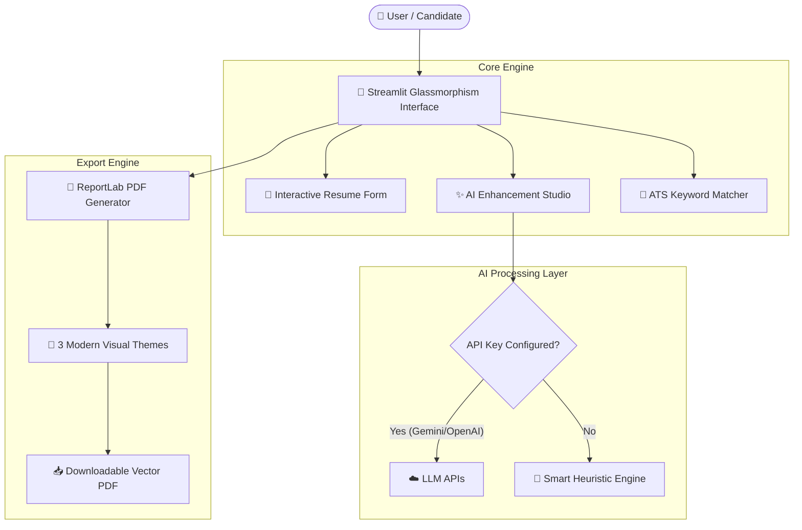

# 📄 AI Resumix Pro — Intelligent CV & Resume Builder

[](https://python.org)
[](https://streamlit.io)
[](https://ai.google.dev)
[](https://openai.com)
[](https://www.reportlab.com)
[](LICENSE)

**AI Resumix Pro** is a modern, full-stack Python application that empowers job seekers and engineers to craft high-impact, ATS-optimized CVs and Resumes powered by Generative AI.

Featuring a dark glassmorphism Streamlit UI, real-time PDF generation across multiple design themes, automated STAR-formula bullet point polishing, and an instant ATS Keyword Compatibility Analyzer.

---

## 🌟 Key Features

- **✨ Generative AI Resume Studio**:
  - **AI Executive Summary Generator**: Crafts tailored 60-80 word summary statements matching target roles.
  - **STAR Bullet Point Polisher**: Rewrites raw bullet points into action-driven statements with metrics.
  - **Skill Taxonomy Recommender**: Auto-suggests high-demand technical and soft skills for any job title.
- **🎯 ATS Keyword & Score Analyzer**:
  - Paste any job posting description to receive an instant **ATS Match Score (0–100%)**.
  - Highlights matched keywords vs. missing critical industry keywords.
  - 1-Click auto-merge missing keywords into your resume skill list.
- **📄 Vector PDF Export Engine (ReportLab)**:
  - 3 professional visual themes: **Modern Executive**, **Creative Tech**, and **Minimalist Classic**.
  - Crisp typography, balanced margins, printable vector quality.
- **⚡ Dual AI Mode + Smart Offline Fallback**:
  - Works with **Google Gemini 1.5** or **OpenAI GPT-3.5/4**.
  - Includes a **Smart Heuristic Engine** out-of-the-box so the app functions seamlessly without an API key!
- **💾 Profile Persistence**: Save and reload resume profiles in JSON format for quick updates.

---

## 🏗️ Architecture



---

## 🚀 Quick Start Guide

### 1. Clone the Repository
```bash
git clone https://github.com/your-username/ai-cv-generator.git
cd ai-cv-generator
```

### 2. Install Dependencies
```bash
python -m pip install -r requirements.txt
```

### 3. (Optional) Configure Environment Variables
Copy `.env.example` to `.env` and add your Gemini or OpenAI API keys:
```bash
cp .env.example .env
```

### 4. Run the Streamlit Application
```bash
python -m streamlit run app.py
```

The web application will launch at `http://localhost:8501`.

---

## 📲 Ready-to-Post LinkedIn Post Template

> *Copy & paste this exact template to post your project on LinkedIn:*

```markdown
🚀 Excited to launch my latest Python project: AI Resumix Pro! 📄🤖

Creating a standout resume shouldn't take hours of manual formatting or guessing what ATS scanners want. So I built an end-to-end AI-powered Resume & CV Generator with a sleek dark glassmorphism interface!

✨ Key Features:
🔹 AI STAR Bullet Rewriter: Transforms weak descriptions into metric-driven accomplishment statements.
🔹 ATS Keyword & Score Analyzer: Evaluates job description match % and highlights missing key terms.
🔹 Multi-Theme PDF Engine: Renders crisp vector PDFs across 3 modern design styles (Modern Executive, Creative Tech, Minimalist Classic).
🔹 Dual-Engine AI: Supports Google Gemini, OpenAI, and a zero-config Smart Offline engine.

🛠️ Built with Python, Streamlit, Google Gemini AI API, and ReportLab.

Check out the code & star the repo on GitHub! 👇
[Insert your GitHub Repo Link Here]

#Python #AI #MachineLearning #Streamlit #OpenSource #SoftwareEngineering #CareerGrowth #WebDevelopment #GenerativeAI
```

---

## 📜 License
Distributed under the MIT License. See `LICENSE` for more information.
